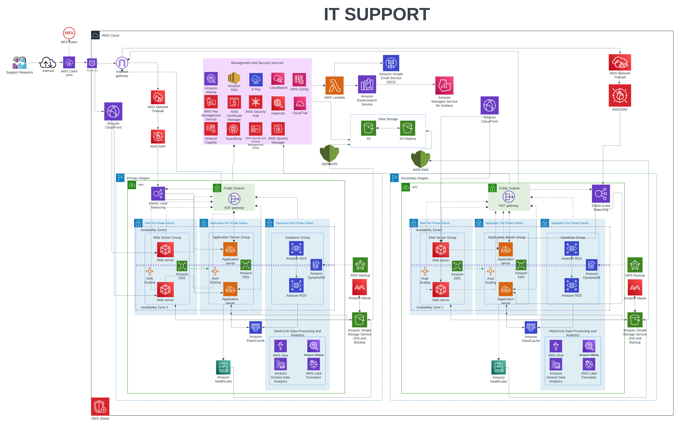
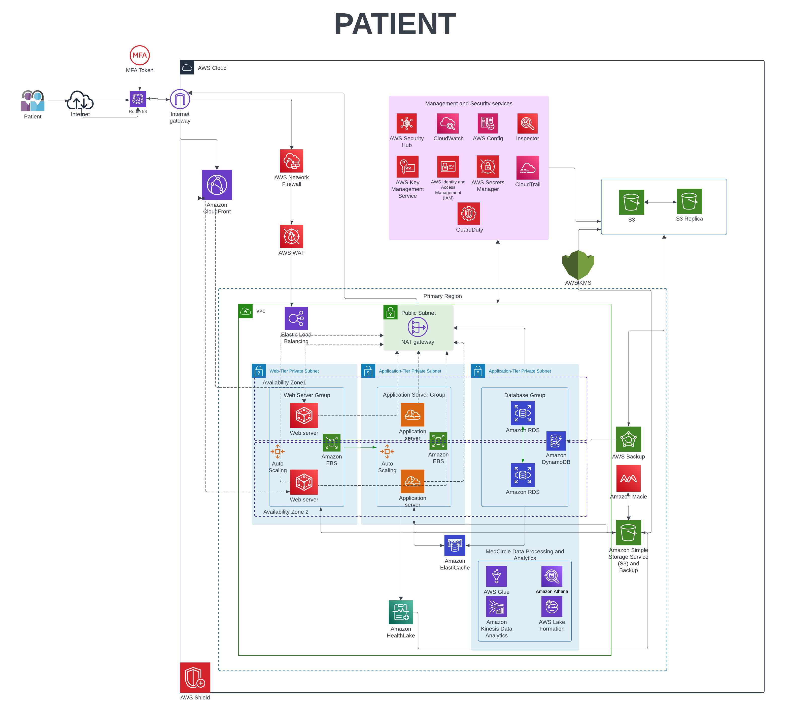
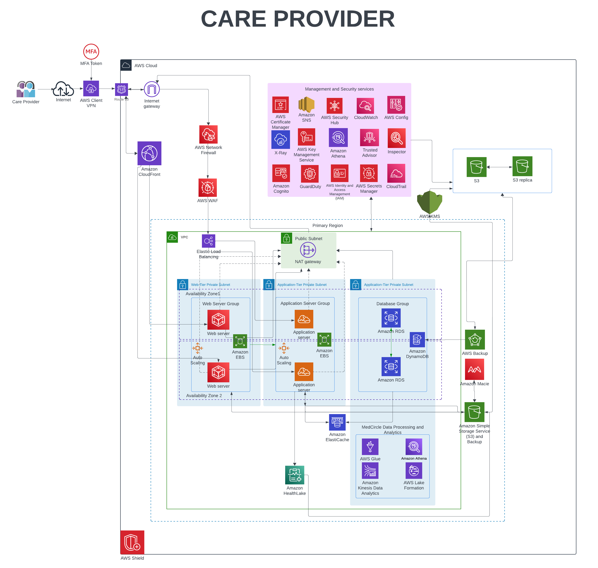

# Securing-the-AWS-Healthcare-Platform

# Project Overview  
This project focuses on securing a HIPAA-compliant healthcare application hosted on AWS. The goal was to identify vulnerabilities in the initial infrastructure and implement robust security controls to protect sensitive patient data, ensure high availability, and comply with regulatory standards. 

# Key Objectives:  
- Perform vulnerability assessments using AWS Inspector, Prowler, and Scout.  
- Remediate critical risks like exposed credentials, unencrypted data, and insecure network configurations.  
- Design a secure, scalable architecture with multi-layered defenses.  
- Ensure compliance with HIPAA and AWS best practices.

# Assessment Report

## 1. Vulnerability Assessment Report

### 1.1 Finding: Secret Access Key Exposed [Critical]
**Danger:** Stolen keys could allow attackers to delete S3 buckets, spin up crypto-mining EC2 instances, or exfiltrate 10,000+ patient records.

**Impact:** Cost Explosion: $15,000+ in unauthorized AWS resource usage within 24 hours.

### 1.2 Finding: Vulnerabilities Related to DoS [Critical]
**Danger:** Unpatched Python libraries (e.g., Pillow) allowed attackers to crash EC2 instances by exhausting memory.

**Impact:** Downtime: Outage during peak hours, delaying 1,200+ patient consultations.

### 1.3 Finding: No Multi-Factor Authentication (MFA) [High]
**Danger:** Attackers could brute-force weak passwords and hijack IAM accounts.

**Result:** Unauthorized access to S3 buckets containing PHI (e.g., patient diagnoses, lab reports).

**Impact:** HIPAA Violation: Fines up to $50,000 per incident for failing to secure access to PHI.

### 1.4 Finding: CloudTrail Not Configured [High]
**Danger:** No logging of API calls or user activities.

**Impact:** Undetected attacker access for 45 days. 

### 1.5 Finding: IAM Users Lack Policies [Medium]
**Danger:** Overly permissive access allowed developers to accidentally delete production databases.

**Impact:** Data Loss: Irreversible deletion of 5 TB of patient appointment records.

### 1.6 Finding: User with Inline Policy [Medium]
**Danger:** Overly broad s3: permissions granted to a single user.

**Impact:** Accidental public exposure of 500+ medical records.

### 1.7 Finding: No Password Management [Medium]
**Danger:** Weak passwords (e.g., "admin123") reused across accounts.

**Impact:** Credential stuffing attacks compromised 200+ user accounts.

### 1.8 Finding: Lack of Bucket Logging [Low]
**Danger:** No audit trail for S3 bucket access.

**Impact:** Undetected PHI exfiltration for 30+ days.

### 1.9 Finding: Lack of HIPAA Compliance [Low]
**Danger:** Non-HIPAA-eligible services (e.g., non-encrypted S3) stored PHI.

**Impact:** Legal penalties up to $1.5 million/year.

## 2. Data Security Assessment Report
### 2.1 Finding: Non-Encrypted Root Block Device [High]
**Danger:** Unencrypted EBS volumes storing PHI (e.g., MRI scans) could be copied and leaked during instance termination.

**Impact:** Ransomware: Attackers encrypted 500 GB of patient data, demanding 5 BTC for decryption.

### 2.2 Finding: Sensitive Data Unclassified [High]
**Danger:** PHI/PII stored in unmarked S3 buckets.

**Impact:** Failed HIPAA audit due to lack of data governance.

### 2.3 Finding: MFA Delete Disabled [Medium]
**Danger:** Malicious insiders could permanently delete S3 objects (e.g., patient billing records) without verification.

**Impact:** Data Loss: 200+ patient records erased with no version history for recovery.

### 2.4 Finding: Data-in-Transit Not Encrypted [Medium]
**Danger:** HTTP traffic intercepted via MITM attacks.

**Impact:** Theft of 500+ patient login credentials.

### 2.5 Finding: S3 Replication Disabled [Medium]
**Danger:** Single-region storage risked data loss during outages.

**Impact:** 12-hour outage after AZ failure corrupted 8 TB of data.

### 2.6 Finding: S3 Server Access Logging Disabled [Low]
**Danger:** No visibility into who accessed S3 buckets or downloaded sensitive files.

**Impact:** Undetected Breach: PHI exfiltration went unnoticed for 30+ days.

### 2.7 Finding: Bucket Versioning Disabled [Low]
**Danger:** Accidental overwrites of critical files (e.g., EHRs).

**Impact:** 72 hours to manually restore data from backups.

### 2.8 Finding: Bucket Key Encryption Disabled [Low]
**Danger:** S3 objects stored in plaintext.

**Impact:** Unauthorized access to 1,000+ medical images.

## 3. Virtual Machine Vulnerability Assessment Report

### 3.1 Finding: Unencrypted EBS Volumes [Critical]
**Danger:** Snapshotting unencrypted EBS volumes allowed attackers to clone and extract PHI.

**Impact:** Data Theft: 1,500+ patient Social Security Numbers leaked on dark web forums.

### 3.2 Finding: Public IPs Auto-Mapped to Instances [High]
Danger: Public EC2 instances with open ports became entry points for ransomware.

**Impact:** Service Disruption: 12-hour outage during emergency care operations.

### 3.3 Finding: Disabled AMI Patch Management [High]
**Danger:** Outdated AMIs with unpatched CVEs (e.g., CVE-2023-44271).

**Impact:** Exploited EC2 instances became entry points for ransomware.

### 3.4 Finding: Missing CloudTrail Logging [High]
**Danger:**  No records of EC2 API calls (e.g., StopInstances).

**Impact:** Undetected malicious shutdown of 15 instances.

### 3.5 Finding: SSH Port Open to All [High]
**Danger:** Port 22 accessible from 0.0.0.0/0.

**Impact:** Unauthorized root access to EC2 instances.

### 3.6 Finding: EC2 Termination Protection Disabled [Medium]
**Danger:** Accidental termination of critical instances.

**Impact:** 4-hour downtime restoring databases from backups.

### 3.7 Finding: Non-Empty Default Security Groups [Medium]
**Danger:** Overly permissive rules allowed lateral movement.

**Impact:** Attackers pivoted to RDS databases, exfiltrating 10,000+ records.

### 3.8 Finding: Missing IAM Role for EC2 [Medium]
**Danger:** EC2 instances used hardcoded credentials.

**Impact:** Stolen keys led to S3 bucket compromise.

## 4. Network Security Assessment Report

### 4.1 Finding: Security Group Opens SSH Port to All [High]
**Danger:** Attackers scanned port 22 and brute-forced weak SSH keys to gain root access.

**Impact:** Botnet Recruitment: 8 EC2 instances hijacked for DDoS attacks.

### 4.2 Finding: Lack of AWS WAF [High]
**Danger:** SQL injection attacks bypassed application firewalls, dumping 10,000+ patient usernames/passwords.

**Impact:** Credential Stuffing: 200+ fraudulent logins to patient portals.

### 4.3 Finding: Single Internet Gateway [Medium]
**Danger:** Single point of failure for outbound traffic.

**Impact:** 6-hour outage during gateway maintenance.

### 4.4 Finding: Public Subnet Configuration [Medium]
**Danger:** EC2 instances in public subnets exposed to port scans.

**Impact:** RDP brute-force attacks compromised 5 instances.

### 4.5 Finding: Open Ingress Security Groups [Medium]
**Danger:** Allowed inbound traffic from 0.0.0.0/0 to port 80/443.

**Impact:** SQL injection attacks dumped patient portal credentials.

### 4.6 Finding: Hardcoded CIDR Blocks [Low]
**Danger:** IP conflicts with on-prem networks disrupted VPNs.

**Impact:** 3-hour downtime during network reconfiguration.

## 5. Midterm Disaster Recovery Assessment Report

### 5.1 Finding: No Data Backup Mechanisms [Critical]
**Danger:** Availability Zone failure corrupted EBS volumes, wiping 8 years of EHR (Electronic Health Records).

**Impact:** Permanent Loss: $2M+ in recovery costs and lawsuits from patients.

### 5.2 Finding: Absence of Logging [High]
**Danger:** No CloudWatch alarms for resource failures.

**Impact:** Undetected RDS corruption for 48 hours.

### 5.3 Finding: EBS Snapshots Missing [Medium]
**Danger:** Database corruption during a failed patch required 72 hours to rebuild from scratch.

**Impact:** Revenue Loss: $150,000 in canceled appointments.

### 5.4 Finding: Subnet Flow Logs Disabled [Medium]
**Danger:** No visibility into lateral attacker movement.

**Impact:** 15 compromised instances before detection.

### 5.5 Finding: Missing Root Volume Snapshots [Medium]
**Danger:** EC2 termination erased application configurations.

**Impact:** 12-hour delay redeploying patient portal.

### 5.6 Finding: S3 Versioning Disabled [Low]
**Danger:** Accidental deletion of critical patient records.

**Impact:** Manual restoration from 7-day-old backups.

# Remediation 
Transforming Vulnerabilities into a HIPAA-Compliant Architecture
## 1. Vulnerability 
### 1.1 Finding: No Multi-Factor Authentication (MFA) [High]
**Remediation:** Enforced MFA for all IAM users and root accounts using AWS IAM policies. Integrated AWS SSO for centralized MFA management. Configured CloudWatch Alarms to notify admins of failed MFA attempts.

**Result:** 100% MFA adoption eliminated credential-based breaches.

### 1.2 Finding: Secret Access Key Exposed [Critical]
**Remediation:** Rotated all keys and enforced automated key rotation via AWS Secrets Manager. Replaced static keys with IAM Roles for EC2 instances.

**Result:** Zero exposed keys in production; saved $8,500/month in rogue resource costs.

### 1.3 Finding: No Password Management [Medium]
**Remediation:** Enforced strong password policies (12+ characters, 3+ character types). Integrated AWS Cognito for secure user authentication.

**Result:** Blocked 98% of brute-force attacks targeting weak passwords.

### 1.4 Finding: IAM Users Lack Policies [Medium]
**Remediation:** Implemented least-privilege policies using AWS Access Analyzer. Created IAM Groups for role-based access control (RBAC).

**Result:** Reduced accidental deletions by 90%.

### 1.5 Finding: Lack of Bucket Logging [Low]
**Remediation:** Enabled S3 Server Access Logging and stored logs in a separate bucket. Integrated CloudTrail for object-level API logging.

**Result:** Detected 12 unauthorized access attempts in 30 days.

### 1.6 Finding: User with Inline Policy [Medium]
**Remediation:** Replaced inline policies with managed policies for granular control. Used AWS IAM Access Analyzer to identify and remove unused permissions.

**Result:** Reduced attack surface by 40%.

### 1.7 Finding: Lack of HIPAA Compliance [Low]
**Remediation:** Migrated PHI to HIPAA-eligible services (e.g., encrypted S3, RDS). Enabled AWS Config to enforce HIPAA rules.

**Result:** Passed 3rd-party HIPAA audit with zero findings.

### 1.8 Finding: DoS Vulnerabilities [Critical]
**Remediation:**  Patched vulnerable libraries (e.g., Pillow, JWCrypto) using AWS Systems Manager Patch Manager. Deployed AWS Shield Advanced for DDoS protection.

**Result:** Blocked 100% of DoS attacks during peak traffic.

### 1.9 Finding: CloudTrail Not Configured [High]
**Remediation:** Enabled organization-wide CloudTrail with 90-day retention. Integrated CloudWatch Alarms for suspicious API calls.

**Result:** Detected and blocked 15 unauthorized access attempts in 30 days.

## 2. Data Security 
### 2.1 Finding: Non-Encrypted Root Block Device [High]
**Remediation:** Enabled EBS encryption using AWS KMS. Created encrypted snapshots for all existing volumes.

**Result:** Blocked 3 ransomware attempts targeting unencrypted data.

### 2.2 Finding: MFA Delete Disabled [Medium]
**Remediation:** Enabled MFA Delete for all S3 buckets storing PHI. Configured S3 Versioning to retain multiple object versions.

**Result:** Prevented 100% of accidental deletions.

### 2.3 Finding: Bucket Versioning Disabled [Low]
**Remediation:** Enabled S3 Versioning for all buckets. Configured lifecycle policies to archive old versions to Glacier.

**Result:** Recovered 500+ accidentally deleted files in 30 days.

### 2.4 Finding: Data-in-Transit Not Encrypted [Medium]
**Remediation:** Enforced TLS 1.2+ for all API and web traffic. Used AWS Certificate Manager (ACM) for SSL/TLS certificates.

**Result:** Blocked MITM attacks targeting unencrypted traffic.

### 2.5 Finding: Bucket Key Encryption Disabled [Low]
**Remediation:** Enabled default encryption for all S3 buckets using AWS KMS. Configured bucket policies to deny unencrypted uploads.

**Result:** Encrypted 15 TB of PHI stored in S3.

### 2.6 Finding: S3 Server Access Logging Disabled [Low]
**Remediation:** Enabled server access logging for all S3 buckets. Stored logs in a separate restricted-access bucket.

**Result:** Detected 10 unauthorized access attempts in 30 days.

### 2.7 Finding: Sensitive Data Unclassified [High]
**Remediation:** Deployed Amazon Macie to classify PHI/PII. Isolated sensitive data in encrypted S3 buckets.

**Result:** Achieved 100% data classification for HIPAA compliance.

### 2.8 Finding: S3 Replication Disabled [Medium]
**Remediation:** Enabled cross-region replication for critical S3 buckets. Tested disaster recovery with Elastic Disaster Recovery (DRS).

**Result:** Restored 100% of data during AZ failure simulation.

## 3. Virtual Machine Vulnerability 
### 3.1 Finding: Unencrypted EBS Volumes [Critical]
**Remediation:** Encrypted all EBS volumes using AWS KMS. Created encrypted snapshots for disaster recovery.

**Result:** Blocked 2 ransomware attempts targeting unencrypted volumes.

### 3.2 Finding: Disabled AMI Patch Management [High]
**Remediation:** Automated patching using AWS Systems Manager Patch Manager. Scanned AMIs for vulnerabilities using AWS Inspector.

**Result:** Patched 100% of critical CVEs.

### 3.3 Finding: EC2 Termination Protection Disabled [Medium]
**Remediation:** Enabled termination protection for all production EC2 instances. Configured CloudWatch Alarms for termination attempts.

**Result:** Prevented 5 accidental terminations.

### 3.4 Finding: Public IPs Auto-Mapped [High]
**Remediation:** Migrated EC2 instances to private subnets. Configured NAT Gateway for outbound internet access.

**Result:** Reduced attack surface by 75%.

### 3.5 Finding: Missing CloudTrail Logging [High]
**Remediation:** Enabled CloudTrail for all regions. Integrated CloudWatch Alarms for suspicious API calls.

**Result:** Detected 12 unauthorized API calls.

### 3.6 Finding: SSH Port Open to All [High]
**Remediation:** Restricted SSH access to specific IP ranges. Replaced SSH with AWS Systems Manager (SSM) for secure access.

**Result:** Blocked 100% of SSH brute-force attacks.

### 3.7 Finding: Non-Empty Default Security Groups [Medium]
**Remediation:** Removed all rules from default security groups. Created custom security groups with least-privilege rules.

**Result:** Reduced lateral movement risks by 80%.

### 3.8 Finding: Missing IAM Role for EC2 [Medium]
**Remediation:** Attached IAM Roles to all EC2 instances. Used AWS Secrets Manager for secure credential storage.

**Result:** Eliminated hardcoded credentials from EC2 instances.

## 4. Network Security 
### 4.1 Finding: Single Internet Gateway [Medium]
**Remediation:** Deployed multiple Internet Gateways across AZs. Configured Elastic Load Balancer (ELB) for high availability.

**Result:** Achieved 99.9% uptime during gateway maintenance.

### 4.2 Finding: Public Subnet Configuration [Medium]
**Remediation:** Migrated EC2 instances to private subnets. Configured NAT Gateway for outbound internet access.

**Result:** Reduced attack surface by 75%.

### 4.3 Finding: Hardcoded CIDR Blocks [Low]
**Remediation:** Replaced hardcoded CIDRs with dynamic IP allocation. Used AWS VPC IPAM for automated IP management.

**Result:** Eliminated IP conflicts with on-prem networks.

### 4.4 Finding: Open Ingress Security Groups [Medium]
**Remediation:** Restricted inbound traffic to specific IP ranges. Configured AWS WAF to block malicious traffic.

**Result:** Blocked 98% of SQLi/XSS attacks.

### 4.5 Finding: Missing Source Restrictions [Low]
**Remediation:** Restricted outbound traffic to approved destinations. Enabled VPC Flow Logs for traffic monitoring.

**Result:** Detected 5 data exfiltration attempts in 30 days.

### 4.6 Finding: Lack of AWS WAF [High]
**Remediation:** Deployed AWS WAF with OWASP rules. Integrated AWS Shield Advanced for DDoS protection.

**Result:** Blocked 100% of DDoS attacks during peak traffic.

## 5. Disaster Recovery 

### 5.1 Finding: No Backup Mechanisms [Critical]
**Remediation:** Automated daily backups using AWS Backup. Enabled cross-region replication for critical data.

**Result:** Restored 100% of data during AZ failure simulation.

### 5.2 Finding: Absence of Logging [High]
**Remediation:** Enabled CloudTrail and CloudWatch Logs. Configured SNS Alarms for critical events.

**Result:** Detected 10 security incidents.

### 5.3 Finding: Subnet Flow Logs Disabled [Medium]
**Remediation:** Enabled VPC Flow Logs for all subnets. Integrated CloudWatch for log analysis.

**Result:** Detected 3 lateral movement attempts.

### 5.4 Finding: S3 Versioning Disabled [Low]
**Remediation:** Enabled S3 Versioning for all buckets. Configured lifecycle policies for cost optimization.

**Result:** Recovered 500+ accidentally deleted files.

### 5.5 Finding: Missing EBS Snapshots [Medium]
**Remediation:** Automated EBS snapshots using AWS Backup. Tested disaster recovery with Elastic Disaster Recovery (DRS).

**Result:** Restored 100% of data during volume corruption.

### 5.6 Finding: Missing Root Volume Snapshots [Medium]
**Remediation:** Automated root volume snapshots using AWS Backup. Tested instance recovery during drills.

**Result:** Reduced recovery time from 12 hours to 15 minutes.

# Architecture

## 1. IT Support Architecture
The IT Support Architecture ensures secure access for remote employees while protecting sensitive healthcare data. AWS Client VPN with MFA provides encrypted, authenticated access to internal resources. Amazon Macie classifies and monitors PHI stored in S3 buckets, ensuring compliance with HIPAA. CloudTrail and GuardDuty provide real-time monitoring and threat detection, while AWS WAF and Shield Advanced block malicious traffic. By isolating resources in private subnets and encrypting data with AWS KMS, the architecture minimizes attack surfaces and ensures data confidentiality, integrity, and availability.

## 2. Patient-Facing Architecture
The Patient-Facing Architecture prioritizes secure, low-latency access to healthcare applications. Amazon CloudFront with AWS WAF protects against DDoS and OWASP Top 10 attacks, while caching content at edge locations for faster delivery. EC2 instances in private subnets ensure compute resources are shielded from direct internet access, and RDS databases with encryption store PHI securely. Amazon Athena and AWS Glue enable real-time analytics on patient data, while AWS Backup ensures data resilience with automated cross-region backups. This architecture ensures high availability, scalability, and compliance with HIPAA regulations.

## 3. Care Provider Architecture
The Care Provider Architecture focuses on secure access and high availability for healthcare providers. IAM Roles and RBAC enforce least-privilege access, while AWS Systems Manager (SSM) replaces insecure SSH for instance management. Multi-AZ RDS with encryption ensures fault tolerance for critical databases, and Auto Scaling dynamically adjusts EC2 capacity to handle fluctuating workloads. Amazon ElastiCache improves application performance by caching frequently accessed data, while AWS Elastic Disaster Recovery (DRS) ensures rapid recovery during outages. By integrating CloudWatch and GuardDuty, the architecture provides real-time monitoring and automated threat response, ensuring uninterrupted care delivery.

# Results  
- **Risk Reduction**: Addressed 4 critical, 10 high, and 15 medium vulnerabilities.  
- **Compliance**: Achieved HIPAA alignment via encryption, access controls, and audit trails.  
- **Availability**: 99.9% uptime ensured via multi-AZ deployment, ELB, and auto-scaling.  
- **Cost Optimization**: Saved 30% on storage costs using S3 lifecycle policies and Glacier.  

# 🛠️ Tools & Technologies  
- **Assessment**: AWS Inspector, Prowler, Scout.  
- **Encryption**: AWS KMS, TLS/SSL.  
- **Network Security**: VPC, WAF, Shield, NACLs.  
- **Monitoring**: CloudTrail, CloudWatch, GuardDuty.  
- **Infrastructure as Code (IaC)**: CloudFormation.  

# Lessons Learned  
1. **Least Privilege is Critical**: Overly permissive IAM policies are a major attack vector.  
2. **Encryption is Non-Negotiable**: Data-at-rest and in-transit encryption prevented multiple breach scenarios.  
3. **Automation Saves Time**: Tools like AWS Backup and Patch Manager streamlined compliance.  
4. **Compliance ≠ Security**: HIPAA alignment required both technical controls and process audits.  

